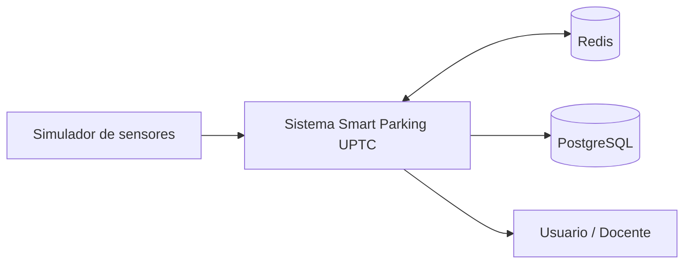
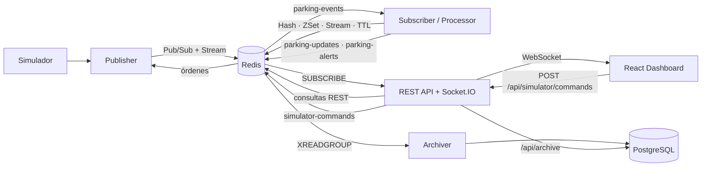
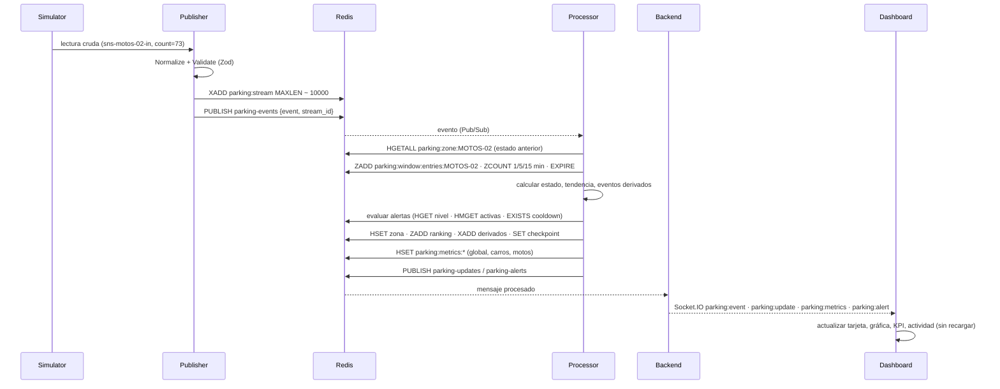
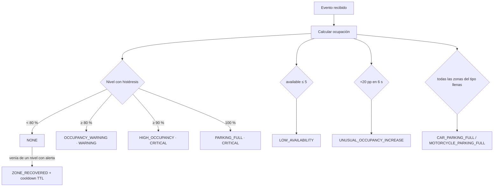

# Arquitectura

UPTC Smart Parking es un sistema **orientado a eventos**. Ningún componente consulta a otro de
forma directa: los servicios se comunican a través de Redis, que actúa a la vez como bus de
mensajes (Pub/Sub), registro de eventos (Streams) y base de datos en memoria (Hashes, Sorted Sets,
claves con TTL). PostgreSQL complementa a Redis como almacenamiento permanente.

## 1. Diagrama de contexto



## 2. Diagrama de contenedores



| Contenedor | Proceso | Entradas | Salidas |
|---|---|---|---|
| **publisher** | Simulador + Publisher | reloj simulado, perfiles, escenarios, `simulator-commands` | `PUBLISH parking-events`, `PUBLISH system-events`, `XADD parking:stream` |
| **processor** | Subscriber + Processor | `SUBSCRIBE parking-events`, `XRANGE parking:stream` (recuperación) | Hashes de estado, ranking, ventanas, métricas, alertas, `PUBLISH parking-updates / parking-alerts` |
| **backend** | Express + Socket.IO | `SUBSCRIBE parking-updates, parking-alerts, system-events`; consultas Redis y PostgreSQL | REST `/api/*`, eventos Socket.IO, `PUBLISH simulator-commands` |
| **archiver** | Consumer group | `XREADGROUP parking:stream, parking:alerts:stream` | `INSERT` en PostgreSQL + `XACK` |
| **frontend** | nginx + React | REST + WebSocket | Interfaz |
| **redis** | Redis 7 | — | — |

## 3. Separación de responsabilidades

```text
FUENTE DE DATOS   Simulador ................. genera lecturas de sensores con continuidad
PUBLISHER         captura → normaliza → valida (Zod) → publica (sin lógica visual ni métricas)
REDIS             Pub/Sub · Streams · Hashes · Sorted Sets · TTL
SUBSCRIBER        escucha parking-events y entrega cada evento, en orden, al Processor
PROCESSOR         estado actual · histórico · ventanas · métricas · ranking · alertas
BACKEND           REST + Socket.IO; no calcula métricas, sólo las lee y las difunde
DASHBOARD         visualización; no calcula estado, sólo lo presenta
ARCHIVER          traslada el histórico de Redis a PostgreSQL
```

Cada servicio es un proceso independiente con su propio `package.json` y puede reiniciarse sin
detener a los demás. La lógica común (tipos, esquemas Zod, constantes de claves, reglas de
ocupación) vive en `packages/shared`, de modo que el contrato de eventos es único.

## 4. Secuencia de una entrada de vehículo



Latencia medida *end-to-end* (`received_at − generated_at`): **p50 ≈ 13 ms, p95 ≈ 16–19 ms** en un
equipo de desarrollo (Docker Desktop, Apple Silicon). El procesamiento de un evento en el Processor
toma ≈ 4–6 ms.

## 5. Flujo de alertas



- Mientras el nivel no cambia **no** se crean alertas nuevas.
- Subir de nivel es inmediato; bajar exige cruzar `umbral − 2 pp` (histéresis).
- Al recuperarse se crea `parking:alert:cooldown:<zona>:OCCUPANCY` con `EX 30`: si la zona vuelve a
  cruzar el 80 % en ese lapso, la advertencia se aplaza hasta que la clave expire.

## 6. Tolerancia a fallos

| Situación | Comportamiento |
|---|---|
| Redis se detiene | Todos los servicios reintentan a 1 s → 2 s → 5 s; la API responde `503 REDIS_UNAVAILABLE`; el Publisher deja de simular hasta reconectar; el dashboard muestra "Redis reconectando". Con RDB, el estado sobrevive al reinicio. |
| Processor detenido | El Publisher registra `receivers=0` (Pub/Sub no guarda mensajes). Al volver, el Subscriber lee `parking:stream` desde su checkpoint (`parking:processor:checkpoint`) y recupera lo perdido; luego publica `RESYNC`. |
| Archiver o PostgreSQL detenidos | Los eventos quedan en el Stream (lag del consumer group). Al volver se archivan; las entradas leídas sin `XACK` se reintentan. Inserciones idempotentes (`ON CONFLICT`). |
| Backend reiniciado | El dashboard pasa a **RECONNECTING**; Socket.IO reconecta solo y el cliente recarga el estado por REST. |
| Publisher reiniciado | Restaura reloj simulado, escenario y ocupación de cada zona desde Redis (`parking:simulator:state`, Hashes de zona). |
| Evento inválido | El Publisher lo rechaza antes de publicarlo; el Subscriber descarta mensajes que no cumplen el esquema. |

## 7. Escalabilidad

- **Más sensores / Publishers:** cada Publisher puede representar una zona, un parqueadero o un grupo
  de sensores; todos publican en los mismos canales y Stream. Los IDs de evento salen de un contador
  atómico de Redis (`INCR parking:seq:event`), por lo que no chocan.
- **Más Processors:** hoy existe un solo Processor por simplicidad (procesa en orden y sin carreras).
  Para escalar se pasaría de Pub/Sub a *consumer groups* sobre `parking:stream` particionando por
  zona (un Stream por grupo de zonas) o se usaría `WATCH`/Lua para actualizar el Hash de forma atómica.
- **Backends:** son sin estado; varios detrás de un balanceador comparten Redis (con el
  `@socket.io/redis-adapter` para difundir a todos los navegadores).
- **Redis:** réplicas de lectura para el dashboard, Redis Sentinel para alta disponibilidad o Redis
  Cluster repartiendo las zonas por *hash slot*.

## 8. Tecnologías

| Capa | Elección | Motivo |
|---|---|---|
| Lenguaje | TypeScript en todos los servicios | Un único modelo de tipos compartido |
| Validación | Zod 4 | Esquemas ejecutables para eventos, órdenes y configuración |
| Redis | ioredis 5 | Reconexión, pipelines, reintento de suscripciones |
| API | Express 5 + Socket.IO 4 | REST + WebSocket con reconexión automática |
| Frontend | React 19, Vite 7, Tailwind 4, Recharts 3, Zustand 5 | Interfaz reactiva con estado centralizado |
| Persistencia | PostgreSQL + pg | Histórico permanente y reportes SQL |
| Infraestructura | Docker Compose | Ejecución reproducible con un solo comando |
| Pruebas | Vitest 4 | Unitarias e integración |
