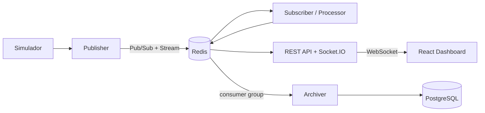

# Documento técnico

---

## 1. Portada

**Universidad Pedagógica y Tecnológica de Colombia — Seccional Sogamoso**

**Asignatura:** Tendencias Modernas de Bases de Datos

**Actividad integradora:** Sistema de estacionamiento inteligente en tiempo real con Redis

**Grupo 4** — Estacionamiento inteligente para carros y motocicletas

**Integrantes:** _(completar)_

**Docente:** _(completar)_

**Fecha:** septiembre de 2026

---

## 2. Introducción

Las bases de datos en memoria cambiaron la forma de construir sistemas que reaccionan a eventos:
además de almacenar datos, ofrecen mecanismos de comunicación y estructuras especializadas que
permiten procesar información dinámica con latencias de milisegundos. Este documento describe el
diseño, la implementación y la validación de **UPTC Smart Parking**, un sistema distribuido que
monitorea en tiempo real la ocupación de los parqueaderos de carros y motocicletas de la Seccional
Sogamoso usando Redis como pieza central.

El sistema simula sensores de conteo, transporta cada entrada o salida de vehículo a través de una
arquitectura orientada a eventos, calcula métricas y alertas, conserva el estado actual y el
histórico reciente en Redis, archiva el histórico permanente en PostgreSQL y muestra todo en un
dashboard web que se actualiza sin recargar la página.

## 3. Descripción del problema

El control de ocupación de estacionamientos requiere conocer de manera rápida cuántos espacios se
encuentran disponibles y cuáles zonas presentan alta demanda. En este proyecto se desarrolla un
sistema de monitoreo en tiempo real para representar conceptualmente los estacionamientos de carros
y motocicletas de la UPTC Seccional Sogamoso. La solución utiliza sensores simulados que generan
eventos de entrada y salida, Redis para comunicación y almacenamiento temporal, un componente de
procesamiento encargado de calcular métricas y alertas, y una aplicación web que permite visualizar
dinámicamente el estado del sistema.

La dificultad no está en guardar un número por zona, sino en que el número cambia continuamente,
que varios componentes necesitan enterarse del cambio al mismo tiempo, que se deben detectar
situaciones críticas en el momento en que ocurren y que el sistema debe seguir funcionando aunque
alguno de sus componentes falle.

## 4. Objetivo general

Diseñar e implementar un sistema distribuido de monitoreo en tiempo real que simule sensores de
estacionamiento, comunique sus eventos mediante Redis, mantenga el estado actual y el histórico
reciente, calcule métricas derivadas, detecte situaciones críticas y actualice una interfaz web
automáticamente.

## 5. Objetivos específicos

1. Usar Redis como base de datos en memoria con cinco mecanismos: Pub/Sub, Streams, Hashes, Sorted Sets y TTL.
2. Construir un simulador de sensores con continuidad temporal, perfiles de demanda y escenarios forzables.
3. Separar Publisher, Subscriber/Processor, Backend y Dashboard en procesos independientes.
4. Validar y normalizar cada evento con un esquema común (Zod).
5. Calcular métricas derivadas: ocupación por zona, global y por tipo; disponibilidad; entradas y salidas por ventana; variación; tendencia; ranking; zonas críticas.
6. Generar alertas sin duplicados, con escalado, histéresis y recuperación.
7. Diferenciar explícitamente estado actual (Hashes) e histórico reciente (Streams).
8. Transmitir los cambios al navegador por WebSocket y medir la latencia end-to-end.
9. Controlar el crecimiento de la información (MAXLEN, TTL, retención).
10. Tolerar la desconexión de Redis, del Processor y del navegador.
11. Conservar el histórico permanente en PostgreSQL.
12. Documentar la arquitectura y garantizar una ejecución reproducible con Docker Compose.

## 6. Alcance

**Incluye:** simulación de 6 zonas (3 de carros, 3 de motocicletas), entradas, salidas, ocupación,
disponibilidad, métricas, alertas, estado actual, histórico reciente, histórico permanente,
visualización y actualización en tiempo real, panel de control de la simulación y panel de
depuración de Redis.

**No pretende representar con exactitud:** sensores físicos reales, capacidades reales,
coordenadas reales, matrículas ni la identidad de los conductores. Los nombres, capacidades y
parámetros de demanda son valores de demostración configurables en `config/`.

## 7. Arquitectura



| Componente | Responsabilidad |
|---|---|
| Simulador | Genera lecturas de sensores con continuidad y perfiles de demanda |
| Publisher | Captura, normaliza, valida y publica (sin lógica visual ni métricas) |
| Redis | Comunicación, estado actual, histórico reciente, ranking, datos temporales |
| Subscriber | Escucha `parking-events` y entrega los eventos en orden al Processor; recupera lo perdido desde el Stream |
| Processor | Estado actual, ventanas, métricas, ranking, alertas, eventos derivados |
| Backend | API REST, puente Redis → Socket.IO, estado del sistema, consultas al archivo |
| Dashboard | Visualización en tiempo real y control de la simulación |
| Archiver | Traslada el histórico de Redis a PostgreSQL |

Los diagramas de contexto, contenedores, secuencia y alertas están en `docs/architecture.md`.

## 8. Tecnologías utilizadas

| Capa | Tecnología |
|---|---|
| Servicios | Node.js 22, TypeScript 5.9, tsx |
| Redis | Redis 7 (Docker), ioredis 5 |
| Validación | Zod 4 |
| API y tiempo real | Express 5, Socket.IO 4 |
| Frontend | React 19, Vite 7, Tailwind CSS 4, Recharts 3, Zustand 5, Lucide |
| Persistencia | PostgreSQL 18 (equipo local) / 18‑alpine (contenedor), node‑postgres |
| Infraestructura | Docker, Docker Compose, nginx |
| Pruebas | Vitest 4 |

## 9. Fuente de datos

No se depende de ninguna API externa. La fuente de datos es un simulador propio que se comporta como
un conjunto de sensores de conteo instalados en la entrada y salida de cada zona. Cada sensor emite
una lectura cruda en su propio formato (identificador en minúsculas, dirección `IN`/`OUT`, conteo
absoluto de vehículos, instante en epoch ms). El Publisher convierte esas lecturas al modelo común de
eventos.

Emitir el **conteo absoluto** (y no sólo "+1/−1") es una decisión deliberada: si un consumidor pierde
eventos, el siguiente evento de la zona corrige su estado.

## 10. Diseño del simulador

- **Estado por zona:** cada `ZoneSimulator` conserva su ocupación; `applyMovement` impide que una
  entrada supere la capacidad o que una salida la lleve por debajo de cero.
- **Ciclo:** cada `SIMULATION_INTERVAL_MS` se calcula el número de movimientos por zona con un proceso
  de Poisson (`λ = intensidad × capacidad × minutos simulados × demandFactor`); cada movimiento es
  entrada con probabilidad `entryWeight`.
- **Saturación:** por encima de un techo (75 % en NORMAL) la probabilidad de entrada decrece de forma
  cuadrática, lo que produce un equilibrio realista y evita alertas críticas en el escenario normal.
- **Distribución temporal:** los movimientos de un ciclo se reparten a lo largo del intervalo, así el
  dashboard recibe eventos continuamente.
- **Semilla:** generador mulberry32 con `SIMULATION_SEED` → ejecuciones reproducibles.
- **Continuidad ante reinicios:** el Publisher guarda y restaura reloj, escenario y ocupación.

## 11. Perfiles de demanda

| Franja | Perfil | Entrada | Salida |
|---|---|---|---|
| 07:00–08:00 | Alta entrada | 0,80 | 0,20 |
| 08:00–12:00 | Estable | 0,50 | 0,50 |
| 12:00–14:00 | Alta salida | 0,25 | 0,75 |
| 14:00–17:00 | Demanda media | 0,55 | 0,45 |
| 17:00–18:00 | Alta salida | 0,15 | 0,85 |
| 18:00–06:00 | Baja | 0,30 | 0,70 |
| 06:00–07:00 | Media (llegadas tempranas) | 0,60 | 0,40 |

Dos modos de tiempo: `REAL_TIME_PROFILE` usa la hora actual de Bogotá; `ACCELERATED_DEMO` recorre
el día 60 veces más rápido (1 minuto real = 1 hora simulada), de modo que en la exposición se ve la
llegada masiva, la estabilidad, la saturación, las salidas y la recuperación en pocos minutos.
Escenarios forzables: `NORMAL`, `HIGH_DEMAND`, `MASS_ENTRY`, `MASS_EXIT`, `NEAR_FULL`, `FULL`,
`RECOVERY` (detalle en `docs/simulator.md`).

## 12. Estructura de eventos

```json
{
  "event_id": "evt_000123",
  "event_type": "VEHICLE_ENTERED",
  "entity_id": "MOTOS-02",
  "timestamp": "2026-09-22T19:30:00.214Z",
  "location": { "latitude": null, "longitude": null },
  "data": { "vehicle_type": "MOTORCYCLE", "zone_name": "Zona M2", "capacity": 80, "occupied": 73,
            "available": 7, "occupancy": 91.25, "entries_per_minute": 3, "exits_per_minute": 1 },
  "metadata": { "source": "SIMULATOR", "schema_version": "1.0", "generated_at": 1790118679708,
                "simulated_time": "14:30", "sensor_id": "SNS-MOTOS-02-IN", "stream_id": "1790118679710-0" }
}
```

Tipos: `VEHICLE_ENTERED`, `VEHICLE_EXITED`, `PARKING_FULL`, `PARKING_AVAILABLE`,
`ZONE_STATUS_CHANGED`, `OCCUPANCY_WARNING`, `OCCUPANCY_CRITICAL`, `ZONE_RECOVERED`,
`SIMULATION_STARTED`, `SIMULATION_STOPPED`, `SCENARIO_CHANGED`. El esquema Zod verifica además las
reglas de consistencia (`occupied ≤ capacity`, `available = capacity − occupied`, porcentaje
correcto). Ver `docs/event-model.md`.

## 13. Redis

Redis resulta adecuado para la actividad porque permite almacenar información directamente en
memoria y ofrece mecanismos orientados a eventos. En nuestra arquitectura Redis no se utiliza
únicamente como almacenamiento, sino también como mecanismo de comunicación mediante Pub/Sub, como
histórico reciente mediante Streams, como almacenamiento del estado actual mediante Hashes y como
mecanismo de ranking mediante Sorted Sets. Las claves siguen la convención
`parking:<categoría>:<identificador>`; el catálogo completo está en `docs/redis-design.md`.

Ventajas aprovechadas de una base en memoria: baja latencia (≈ 4–6 ms para procesar un evento con
≈ 6 viajes a Redis), lecturas y escrituras rápidas, estructuras especializadas, Pub/Sub y Streams
integrados, y expiración automática de datos.

## 14. Redis Pub/Sub

Pub/Sub permite distribuir inmediatamente los eventos generados por el Publisher hacia los
consumidores conectados. Esto permite que el Processor reaccione rápidamente ante entradas, salidas
y cambios de estado.

| Canal | Publica | Escucha | Contenido |
|---|---|---|---|
| `parking-events` | Publisher | Processor | eventos crudos de sensor |
| `parking-updates` | Processor | Backend | estado procesado, métricas, eventos derivados, muestras, RESYNC |
| `parking-alerts` | Processor | Backend | alertas levantadas y resueltas |
| `system-events` | Publisher | Backend | inicio, pausa, cambios de escenario |
| `simulator-commands` | Backend | Publisher | órdenes del panel de simulación |

El Publisher registra cuántos suscriptores recibieron cada mensaje; con el Processor detenido aparece
`receivers=0` y la advertencia de que Pub/Sub no conserva mensajes.

## 15. Redis Streams

Redis Streams permite conservar temporalmente los eventos, permitiendo consultar el histórico
reciente y diferenciándolo de Pub/Sub, cuyo objetivo principal es la comunicación inmediata.

- `parking:stream` (`MAXLEN ~ 10000`): todos los eventos; lo usan la recuperación del Processor,
  el historial de cada zona y el archiver.
- `parking:timeseries` (`MAXLEN ~ 5000`): una muestra de métricas cada 2 s; alimenta las gráficas
  (los IDs de Stream son marcas de tiempo, así que `XRANGE` por tiempo es directo).
- `parking:alerts:stream` (`MAXLEN ~ 2000`): historial de alertas.
- Consumer group `archiver`: entrega con confirmación (`XREADGROUP` / `XACK`) hacia PostgreSQL.

## 16. Redis Hashes

Cada Hash representa el estado actual de una zona. Esta estructura permite consultar y actualizar
rápidamente atributos como capacidad, ocupación, disponibilidad, porcentaje y estado.
`parking:zone:<id>` guarda 28 campos (sección 10 del enunciado más tendencia, variaciones,
promedios y trazabilidad). También son Hashes las métricas agregadas (`parking:metrics:global`,
`:cars`, `:motorcycles`), las alertas activas, el nivel de alerta por zona, las estadísticas y el
estado del simulador.

## 17. Redis Sorted Sets

Los Sorted Sets permiten mantener las zonas ordenadas dinámicamente según su porcentaje de ocupación
y consultar rápidamente qué zona presenta mayor saturación
(`ZREVRANGE parking:ranking:occupancy 0 0 WITHSCORES`). Además se usan como **ventanas deslizantes**:
cada entrada o salida se agrega con su instante como score y `ZCOUNT` cuenta los eventos del último
minuto, de los últimos 5 y de los últimos 15 minutos.

## 18. TTL

TTL permite eliminar automáticamente información temporal y ayuda a evitar que Redis conserve
indefinidamente datos que dejan de ser útiles.

| Clave | TTL | Uso |
|---|---|---|
| `parking:heartbeat:<servicio>` | 10 s | Detección de servicios caídos (ONLINE mientras exista) |
| `parking:alert:cooldown:<zona>:<clave>` | 30 s | Evita alertas repetidas tras una recuperación |
| `parking:temporary:metric:*` | 10 s | Eventos/s y tiempo de procesamiento instantáneos |
| `parking:window:*` | 960 s | Ventanas de zonas inactivas |

## 19. Publisher

Flujo por movimiento: **capturar** (el sensor aplica el movimiento sobre la ocupación actual) →
**normalizar** (`EventNormalizer`) → **validar** (`validateSensorEvent`, Zod) → **publicar**
(`XADD parking:stream` y `PUBLISH parking-events`). Los eventos pasan por una cola serial que
conserva el orden de captura. El Publisher también atiende las órdenes del panel de simulación
(`simulator-commands`), publica los eventos del sistema y mantiene su heartbeat. No calcula gráficas
ni contiene lógica visual.

## 20. Subscriber

`EventSubscriber` usa una conexión dedicada (`SUBSCRIBE` bloquea la conexión), descarta mensajes que
no cumplen el esquema y entrega cada evento al Processor a través de una cola serial (los eventos de
una zona nunca se procesan en paralelo). Al iniciar y tras cada reconexión lee `parking:stream` desde
el checkpoint y recupera los eventos perdidos; los duplicados se descartan por `stream_id`.

## 21. Processor

Pasos por evento: validar → obtener estado anterior (`HGETALL`) → registrar el movimiento en la
ventana (`ZADD` + `ZCOUNT`) → calcular el estado actual → evaluar alertas → derivar eventos →
guardar (`HSET`, `ZADD` ranking, `XADD` derivados, checkpoint) → calcular métricas globales
(`HSET parking:metrics:*`) → publicar (`parking-updates`, `parking-alerts`). Cada 2 s un muestreador
recalcula las ventanas de todas las zonas, agrega una muestra a `parking:timeseries` y revisa las
alertas que dependen del paso del tiempo.

## 22. Estado actual

El estado actual representa la última información conocida de cada zona. Por ejemplo, la Zona M2
puede encontrarse actualmente en 91,25 % de ocupación.

```text
HGETALL parking:zone:MOTOS-02
→ capacity 80 · occupied 73 · available 7 · occupancy 91.25 · status CRITICAL · trend RISING …
```

Responde a la pregunta: *¿cómo está M2 ahora?*

## 23. Histórico reciente

El histórico reciente representa cómo ha evolucionado esa zona a través de eventos anteriores y
permite construir las gráficas temporales.

```text
XREVRANGE parking:stream + - COUNT 50        → entradas, salidas, cambios de estado
XRANGE parking:timeseries <hace 15 min> +     → 14:00 62 % · 14:05 68 % · 14:10 75 % · …
```

Responde a la pregunta: *¿cómo ha evolucionado M2?* El panel de detalle de cada zona muestra ambos
lados: "Estado actual — HGETALL" y "Últimos eventos — XREVRANGE".

## 24. Procesamiento

El Processor no reenvía la ocupación tal como la entrega el simulador: calcula información nueva
(disponibilidad, porcentaje, categoría, variación, tendencia, ventanas, promedios, ranking, eventos
derivados y alertas). Detecta además inconsistencias: si el conteo informado no coincide con el
esperado (eventos perdidos), registra una resincronización y adopta el conteo absoluto.

## 25. Métricas

| # | Métrica | Cálculo |
|---|---|---|
| 1 | Ocupación por zona | `occupied / capacity × 100` |
| 2 | Espacios disponibles | `capacity − occupied` |
| 3 | Ocupación global | `Σ occupied / Σ capacity × 100` |
| 4 | Ocupación de carros | idem, sólo `vehicle_type = CAR` |
| 5 | Ocupación de motocicletas | idem, sólo `MOTORCYCLE` |
| 6 | Entradas por minuto | `ZCOUNT` de la ventana de 60 s |
| 7 | Salidas por minuto | idem para salidas |
| 8 | Zona más ocupada | `ZREVRANGE parking:ranking:occupancy 0 0 WITHSCORES` |
| 9 | Zonas críticas | zonas en `CRITICAL` o `FULL` |
| 10 | Variación | ocupación actual − anterior (por evento) y − hace 5 min |
| 11 | Tendencia | `RISING` / `FALLING` / `STABLE` con umbral de 3 pp en 30 s |
| — | Ventanas | entradas/salidas en 1, 5 y 15 min; promedio de ocupación en 1, 5 y 15 min |
| — | Internas | eventos/s, tiempo de procesamiento, latencia end-to-end |

## 26. Alertas

Cada alerta tiene `id`, `zone_id`, `type`, `severity`, `message`, `value`, `threshold`,
`timestamp` y `status`. Reglas: `OCCUPANCY_WARNING` (≥ 80 %), `HIGH_OCCUPANCY` (≥ 90 %),
`PARKING_FULL` (100 %), `LOW_AVAILABILITY` (≤ 5 espacios), `UNUSUAL_OCCUPANCY_INCREASE`
(+20 pp en 6 s), `CAR_PARKING_FULL` / `MOTORCYCLE_PARKING_FULL`.

La evaluación es una **máquina de estados** por zona (NONE → WARNING → CRITICAL → FULL):

- mientras el nivel se mantiene no se crea una alerta nueva (sin duplicados);
- al subir se resuelve la alerta anterior como `ESCALATED` y se crea la nueva;
- para bajar hay que cruzar el umbral menos 2 pp (histéresis), lo que evita alertas intermitentes;
- al volver a NONE la alerta se resuelve como `RECOVERED`, se emite `ZONE_RECOVERED` y se crea una
  clave de cooldown con TTL de 30 s.

Las alertas activas viven en `parking:alerts:active`; su historial en `parking:alerts:stream` y en
la tabla `alerts` de PostgreSQL.

## 27. Comunicación en tiempo real

El backend se suscribe a `parking-updates`, `parking-alerts` y `system-events` y reenvía cada mensaje
por Socket.IO (`parking:event`, `parking:update`, `parking:metrics`, `parking:alert`,
`parking:recovery`, `parking:resync`, `system:status`, `simulator:state`). El navegador nunca recarga:
agrupa los mensajes cada 120 ms y actualiza el estado. Se miden tres instantes (`generated_at` en el
Publisher, `processed_at` en el Processor y `received_at` en el navegador) para calcular la latencia
end-to-end que muestra el encabezado.

## 28. Backend

Express 5 con controladores delgados, validación de parámetros con Zod y errores uniformes
(`{ error: { code, message } }`). La conexión de consulta a Redis falla rápido cuando Redis no está
disponible (`503 REDIS_UNAVAILABLE`) en lugar de bloquear peticiones. Endpoints: salud, zonas,
historial de zona, métricas (global, carros, motos, serie temporal), alertas (activas e historial),
eventos, ranking, estado del sistema, simulador, depuración de Redis (claves, inspector de sólo
lectura, suscriptores) y archivo en PostgreSQL. Opcionalmente protege las órdenes del simulador con
`DEMO_CONTROL_TOKEN`.

## 29. Dashboard

- **Encabezado:** UPTC SMART PARKING, ● LIVE / RECONNECTING, "Redis Connected", hora simulada y perfil,
  latencia E2E, indicador de nuevo evento (pulso de ~450 ms) y última actualización.
- **KPIs:** ocupación global con variación de 5 min, carros, motocicletas, disponibles (carros/motos),
  zonas críticas y flujo del último minuto.
- **Plano conceptual:** dos parqueaderos, seis zonas; cada tarjeta muestra nombre, tipo, ocupados/
  capacidad, barra, porcentaje, estado (icono + texto), disponibles, tendencia, flujo y última
  actualización, más una cuadrícula con un cuadro por espacio. Se ilumina ~500 ms al recibir cambios.
- **Detalle de zona:** estado actual (Hash) vs histórico (Stream), curva de 15 min, alertas y acciones
  de demostración.
- **Gráficas:** evolución de ocupación (todas / carros / motos / zona; 5 o 15 min; líneas de umbral),
  entradas vs salidas por minuto y ocupación por zona (ranking en barras).
- **Actividad en tiempo real** con filtros y **alertas activas / resueltas** con modal de detalle.
- **Recorrido de un evento:** contadores en vivo de cada etapa de la arquitectura.
- Páginas `/simulator`, `/system` y `/debug`.

Tema claro: fondo y paneles blancos, texto en negro (`#0B1220`) y azul (`#1E3A8A` / `#3F5A99`);
carros en azul (`#2563EB`) y motocicletas en fucsia (`#A21CAF`). Cada estado tiene un color para
marcas y otro más oscuro para texto, con contraste de al menos 4,5:1 sobre blanco. Los colores de
series se verificaron con un validador de daltonismo sobre fondo blanco; además todas las series
llevan etiqueta directa, leyenda e icono, y los estados nunca dependen sólo del color.

## 30. Docker

`docker-compose.yml` define `redis`, `publisher`, `processor`, `backend`, `archiver` y `frontend`,
más los perfiles opcionales `insight` (RedisInsight) y `local-db` (PostgreSQL). Los cuatro servicios
Node comparten una imagen (`docker/node.Dockerfile`) y se diferencian por el comando; el frontend se
compila con Vite y se sirve con nginx, que también reenvía `/api` y `/socket.io` al backend. Redis
tiene *healthcheck* y los servicios esperan a que esté sano. `config/` se monta como volumen: cambiar
zonas o umbrales sólo requiere reiniciar.

## 31. Instalación

```bash
git clone <repo>
cd uptc-smart-parking
cp .env.example .env
npm run db:setup          # usuario proyecto_electiva_1 / Admin y base uptc_smart_parking
```

## 32. Ejecución

```bash
docker compose up --build                     # sistema completo
docker compose --profile insight up --build   # + RedisInsight (http://localhost:5540)
```

Dashboard en <http://localhost:5173>, API en <http://localhost:3000/api/health>. Para desarrollo:
`npm install`, `cp .env.local.example .env.local`, `docker compose up -d redis` y `npm run dev`.

## 33. Pruebas realizadas

| Prueba | Cómo | Resultado |
|---|---|---|
| Unitarias (68) | `npm test` | ✔ ocupación 73/80 → 91,25 % y 7 disponibles; estados en cada umbral; límites; entrada en zona llena; salida en zona vacía; tendencia; perfiles; continuidad del simulador; escenarios; normalización y validación; métricas; alertas |
| Integración (4) | `npm run test:integration` (Redis desechable) | ✔ Pub/Sub, Stream con MAXLEN, Hash + Sorted Set + secuencia de alertas con TTL, recuperación tras desconexión |
| Tiempo real | `node scripts/socket-probe.mjs` y navegador | ✔ eventos por WebSocket sin recargar; latencia E2E p50 13 ms, p95 16–19 ms |
| Alertas (sección 131) | Panel: *Cerca de lleno* → *Llenar zona* → *Recuperación* en Zona C | ✔ OCCUPANCY_WARNING → OCCUPANCY_CRITICAL → PARKING_FULL → OCCUPANCY_WARNING (desescalado) → ZONE_RECOVERED; alerta crítica resuelta |
| Subscriber desconectado (132) | `docker compose stop processor` 10 s | ✔ Publisher `receivers=0`; al volver: *Recovered 106 events missed while offline from parking:stream* + RESYNC |
| Reconexión Redis (133) | `docker compose stop redis` 8 s | ✔ reintentos 1 s → 2 s → 5 s en todos los servicios; API 503 durante la caída; `healthy` al volver; estado conservado (RDB) |
| Persistencia | archiver con PostgreSQL local desde Docker | ✔ lag 0; reporte diario por zona en `daily_zone_summary` |

## 34. Resultados

- Flujo completo Simulador → Publisher → Redis → Processor → Backend → WebSocket → Dashboard funcionando
  en Docker con un solo comando.
- ≈ 3 400 eventos por día simulado; en la franja de mayor demanda ≈ 7 eventos/s.
- Procesamiento: 4–6 ms por evento. Latencia end-to-end: ≈ 13 ms (p50).
- Memoria de Redis: ≈ 9 MB con el Stream en su límite de 10 000 eventos (límite configurado: 256 MB).
- En el escenario NORMAL las zonas alcanzan 78–86 % en el pico sin alertas críticas; los escenarios
  forzados producen cada tipo de alerta y su recuperación.

## 35. Control del crecimiento de datos

| Dato | Estrategia |
|---|---|
| `parking:stream` | `XADD … MAXLEN ~ 10000` |
| `parking:timeseries` | `MAXLEN ~ 5000` (≈ 2,7 h de muestras) |
| `parking:alerts:stream` | `MAXLEN ~ 2000` |
| Ventanas | `ZREMRANGEBYSCORE` a 15 min + `EXPIRE 960` |
| Datos temporales | TTL (heartbeats, cooldowns, métricas instantáneas) |
| Alertas resueltas | `HDEL` del Hash de activas |
| Memoria | `maxmemory 256mb`, `volatile-lru` (sólo se desalojan claves con TTL) |
| PostgreSQL | retención configurable (`ARCHIVE_RETENTION_DAYS`, 30 días) |

## 36. Limitaciones

- La memoria RAM es más limitada que el almacenamiento en disco.
- Los datos temporales pueden perderse dependiendo de la configuración de persistencia (se usa RDB:
  una caída abrupta puede perder los últimos minutos; AOF reduciría la pérdida a ~1 s).
- Redis no reemplaza una base histórica permanente; por eso se incorporó PostgreSQL.
- Pub/Sub no conserva mensajes para consumidores desconectados (mitigado con Streams + checkpoint).
- Un solo Processor procesa en serie; para cargas mucho mayores habría que particionar.
- Las ventanas temporales se miden en tiempo real: con velocidad x5 la compresión del tiempo hace que
  el pico matutino pueda detectarse como crecimiento inusual.
- Los datos son simulados; capacidades, zonas y perfiles no corresponden a la universidad.

## 37. Dificultades encontradas

1. **Canales Pub/Sub globales.** Las primeras pruebas de integración usaban la base lógica 15 de Redis
   pensando que estaban aisladas, pero los canales Pub/Sub son globales a la instancia: el Processor
   en ejecución recibió los eventos de prueba. Se trasladaron las pruebas a un Redis desechable.
2. **Alertas "parpadeantes".** Una zona de 50 puestos que oscila entre 39 y 40 vehículos cruza el 80 %
   con cada auto. Se agregó histéresis (2 pp) y cooldown con TTL, y los eventos
   `OCCUPANCY_WARNING/CRITICAL` pasaron a derivarse de la máquina de alertas.
3. **Pico matutino como "crecimiento inusual".** Con 1 min = 1 h, el ingreso normal de la mañana
   parecía inusual con una ventana de 15 s; se calibró a 6 s para distinguir el pico (~7 pp) de una
   entrada masiva (~30 pp).
4. **Calibración inicial.** El primer evento de cada zona saltaba de 0 a la ocupación real y
   disparaba alertas falsas; se trató como calibración.
5. **IDs de alerta repetidos.** Al vaciar Redis el contador de alertas se reinicia; PostgreSQL
   descartaba alertas nuevas con IDs ya usados. La clave pasó a ser `(id, raised_at)` con migración.
6. **Dos versiones de Vite** instaladas por dependencias transitivas; se fijó una única versión.

## 38. Mejoras futuras

- Sensores reales (MQTT / LoRaWAN) publicando en Redis Streams.
- Varios Processors con consumer groups y particionamiento por zona; Redis Sentinel o Cluster.
- Predicción de ocupación (series de tiempo) y recomendaciones de zona libre para los conductores.
- Aplicación móvil y pantallas en las entradas del campus con disponibilidad en vivo.
- Autenticación de usuarios y roles (vigilancia, administración).
- Particionado mensual en PostgreSQL y un tablero de analítica histórica.
- Integración con el calendario académico para ajustar los perfiles de demanda.

## 39. Conclusiones

- Redis cumple varios papeles a la vez: bus de eventos (Pub/Sub), registro de eventos (Streams),
  base de datos del estado actual (Hashes), índice ordenado (Sorted Sets) y almacén de datos
  temporales (TTL). Cada estructura resuelve un problema concreto del sistema.
- La diferencia entre **estado actual** e **histórico reciente** es operativa: el Hash responde en una
  sola lectura cómo está una zona; el Stream permite reconstruir cómo llegó ahí y recuperar eventos.
- Pub/Sub y Streams son complementarios: el primero da inmediatez, el segundo durabilidad; juntos
  permiten un sistema en tiempo real que tolera la caída de sus consumidores.
- Una simulación con continuidad y perfiles produce datos creíbles y permite demostrar condiciones
  normales, críticas y de recuperación de forma controlada.
- Las alertas útiles requieren estado (niveles, histéresis, cooldown), no sólo comparaciones con un
  umbral.
- Una base en memoria no reemplaza a una base histórica: PostgreSQL complementa a Redis para la
  información que debe durar.
